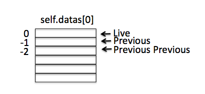
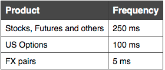
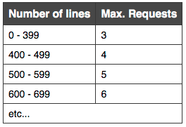

Introduction
============

Currently `backtrader` has a built-in integration for Interactive Brokers (IB) [Trader Workstation API](<http://interactivebrokers.github.io/tws-api/>), but it only works for older versions of the API. 

This project re-worked the orginal integration and created a pluggable version allowing `backtrader` to use the latest IB API.

To start trading follow the steps below:

1.	Open an account with IB 
2.	Download the [IB Python TWS API](https://github.com/InteractiveBrokers/tws-api-public) 
3.	Download the IB client (TWS or IB Gateway) [Trader Workstation Platform](https://www.interactivebrokers.com/en/home.php)
4.	Test for connectivity – Check code sample below

Installation
------------

Create a local python virtual environment:

`python3 -m venv ./env`

Activate the environment, all the following packages will be install in the local ./env directory

`source ./env/bin/activate`

Install backtrader locally (see [Installing Backtrader](https://www.backtrader.com/docu/installation/) for more options)

`pip install backtrader`

Download Interactive Brokers TWS API (from [Trader Workstation API](https://github.com/InteractiveBrokers/tws-api-public))

Select the latest copy, currently it is (twsapi_macunix.1016.01.zip) for Linux

`unzip twsapi_macunix.1016.01.zip`

The file will unzip to the directoty `IBJts`

`cd IBJts/source/pythonclient`

Run the setup.py to install the TWS API.

`python setup.py install`

Download a Atreyu Backtrader API, released version:

`wget https://github.com/atreyuxtrading/atreyu-backtrader-api/archive/refs/tags/v1.0.zip`

Unzip file, and install the Atreyu Backtrader API.

`unzip v1.0.zip`

`cd atreyu-backtrader-api-1.0 ; python setup.py install`

Check Settings of Locally Running TWS
-------------------------------------


Example: Download Realtime Bar Data from TWS
-------------------------------------------

```python
import backtrader as bt
from atreyu_backtrader_api import IBData

cerebro = bt.Cerebro()

data = IBData(host='127.0.0.1', port=7497, clientId=35,
               name="GOOG",     # Data name
               dataname='GOOG', # Symbol name
               secType='STK',   # SecurityType is STOCK 
               exchange='SMART',# Trading exchange IB's SMART exchange 
               currency='USD',  # Currency of SecurityType
               what='BID_ASK',  # Get data fields (see note below)
               rtbar=True,      # Request Realtime bars
               _debug=True      # Set to True to print out debug messagess from IB TWS API
              )

cerebro.adddata(data)
cerebro.run()
```

Create A TestPrinter
--------------------
Note that this is created as a stratgey and will print all the bars that it receives

```python

import backtrader as bt

class TestPrinter(bt.Strategy):

    def log(self, txt, dt=None):
        ''' Logging function for this strategy'''
        dt = dt or self.datas[0].datetime.datetime(0)
        print(f'{dt}, {txt}')

    def __init__(self):
        self.open = self.datas[0].open
        self.high = self.datas[0].high
        self.low = self.datas[0].low
        self.close = self.datas[0].close
        self.volume = self.datas[0].volume
        self.openinterest = self.datas[0].openinterest

    def next(self):
        self.log(f'Open:{self.open[0]:.2f}, \
                   High:{self.high[0]:.2f}, \
                   Low:{self.low[0]:.2f}, \
                   Close:{self.close[0]:.2f}, \
                   Volume:{self.volume[0]:.2f}, \
                   OpenInterest:{self.volume[0]:.2f}' )
        
```

Simple BID_ASK Historical Data
-------------------------------

```python

import backtrader as bt

from atreyu_backtrader_api import IBData
from test_printer import TestPrinter

import datetime as dt

cerebro = bt.Cerebro()

data = IBData(host='127.0.0.1', port=7497, clientId=35,
               name="GOOG",     # Data name
               dataname='GOOG', # Symbol name
               secType='STK',   # SecurityType is STOCK 
               exchange='SMART',# Trading exchange IB's SMART exchange 
               currency='USD',  # Currency of SecurityType
               historical=True,
               what='BID_ASK',  # Update this parameter to select data type
              )

cerebro.adddata(data)

# Add the printer as a strategy
cerebro.addstrategy(TestPrinter)

cerebro.run()

```
Output
------
```
2021-08-09 23:59:59.999986, Open:137.24, High:144.44, Low:136.25, Close:137.55, Volume:-1.00
2021-08-10 23:59:59.999986, Open:138.02, High:139.84, Low:125.00, Close:138.26, Volume:-1.00
2021-08-11 23:59:59.999986, Open:137.54, High:138.95, Low:130.66, Close:137.89, Volume:-1.00
2021-08-12 23:59:59.999986, Open:137.82, High:139.07, Low:130.00, Close:138.12, Volume:-1.00
2021-08-13 23:59:59.999986, Open:138.23, High:139.09, Low:137.78, Close:138.52, Volume:-1.00
2021-08-16 23:59:59.999986, Open:138.04, High:139.90, Low:125.00, Close:138.34, Volume:-1.00
....
2022-08-05 23:59:59.999986, Open:118.06, High:128.00, Low:111.06, Close:118.19, Volume:-1.00
2022-08-07 20:00:00, Open:118.93, High:120.88, Low:113.00, Close:119.02, Volume:-1.00
```

Select Historical Data Types Using "what=" Parameter
-----------------------------------------------------
Historical data is returned in the form of candlesticks, and accessed using the “what=” parameter when requesting data. (see [Interactive Brokers Data Types](https://interactivebrokers.github.io/tws-api/historical_bars.html))


Fetch what=TRADES between 2016/01/01 - 2018/01/01
-------------------------------------------------

```python
import backtrader as bt

from atreyu_backtrader_api import IBData
from test_printer import TestPrinter

import datetime as dt

cerebro = bt.Cerebro()

data = IBData(host='127.0.0.1', port=7497, clientId=35,
               name="GOOG",     # Data name
               dataname='GOOG', # Symbol name
               secType='STK',   # SecurityType is STOCK 
               exchange='SMART',# Trading exchange IB's SMART exchange 
               currency='USD',  # Currency of SecurityType
               fromdate = dt.datetime(2016, 1, 1),
               todate = dt.datetime(2018, 1, 1),
               historical=True,
               what='TRADES',
              )

cerebro.adddata(data)

# Add the printer as a strategy
cerebro.addstrategy(TestPrinter)

cerebro.run()
```

Output
------
```
2016-01-05 00:00:00, Open:37.38, High:37.38, Low:36.56, Close:37.10, Volume:460493.60
2016-01-06 00:00:00, Open:37.00, High:37.60, Low:36.93, Close:37.15, Volume:272008.00
2016-01-07 00:00:00, Open:36.87, High:37.36, Low:36.25, Close:37.30, Volume:276044.20
2016-01-08 00:00:00, Open:36.17, High:36.92, Low:35.95, Close:36.50, Volume:425276.00
...
2017-12-27 00:00:00, Open:52.86, High:53.00, Low:52.51, Close:52.70, Volume:70263.00
2017-12-28 00:00:00, Open:52.90, High:52.92, Low:52.40, Close:52.46, Volume:151108.40
2017-12-29 00:00:00, Open:52.66, High:52.74, Low:52.24, Close:52.36, Volume:105796.60
2017-12-30 00:00:00, Open:52.42, High:52.55, Low:52.13, Close:52.24, Volume:75590.60
```

How is the Data Presented in the Strategy?
------------------------------------------
The data retrieved from IB is presented in the strategy as the variable self.datas[0].

The latest close price is available at index 0, and progressively earlier prices are stored using a negative index. (See diagram below)



```python
import backtrader as bt

# Create a Stratey
class TestStrategy(bt.Strategy):

    def log(self, txt, ts=None):
        ''' Logging function for this strategy'''
        ts = ts or self.datas[0].datetime.datetime(0)
        print(f'{ts}, {txt}')

    def __init__(self):
        self.close = self.datas[0].close

    def next(self):
        # Current close
        self.log(f'Close:{self.close[0]:.2f}' )
        if self.close[0] < self.close[-1]:
             # current close less than previous close, think about buying
             if self.close[-1] < self.close[-2]:
                # previous close less than previous close, so buy
                self.log('BUY CREATE, %.2f' % self.close[0])
                self.buy()
```

Using IB Historical Data to Drive a Strategy with "what=MIDPOINT"
---------------------------------------------------------------

```python
import backtrader as bt

from atreyu_backtrader_api import IBData
from test_strategy import TestStrategy

import datetime as dt

cerebro = bt.Cerebro()

data = IBData(host='127.0.0.1', port=7497, clientId=35,
               name="GOOG",     # Data name
               dataname='GOOG', # Symbol name
               secType='STK',   # SecurityType is STOCK 
               exchange='SMART',# Trading exchange IB's SMART exchange 
               currency='USD',  # Currency of SecurityType
               fromdate = dt.datetime(2016, 1, 1),
               todate = dt.datetime(2018, 1, 1),
               historical=True,
               what='MIDPOINT',
              )

cerebro.adddata(data)

# Add the test strategy
cerebro.addstrategy(TestStrategy)

# Set our desired cash start
cerebro.broker.setcash(100000.0)

cerebro.run()

print('Final Portfolio Value: %.2f' % cerebro.broker.getvalue())
```

Naming Datasources and using them in a Strategy
-----------------------------------------------
Datasources can be given logical datanames (i.e. based on the "what" parameter), the logical name can then be accessed using the \_name variable.
In the strategy below the logical name is stored in the self.name0 and self.name1 variables, and can be used to identify the buy for each symbol.

```python
import backtrader as bt

# Create a Stratey
class TestStrategy(bt.Strategy):

    def log(self, txt, ts=None):
        ''' Logging function for this strategy'''
        ts = ts or self.datas[0].datetime.datetime(0)
        print(f'{ts}, {txt}')

    def __init__(self):
        self.close0 = self.datas[0].close
        self.name0 = self.datas[0]._name

        self.close1 = self.datas[1].close
        self.name1 = self.datas[1]._name

    def next(self):
        # Current close dataset0
        self.log(f'{self.name0} Close:{self.close0[0]:.2f}' )
        if self.close0[0] < self.close0[-1]:
             # current close less than previous close, think about buying
             if self.close0[-1] < self.close0[-2]:
                # previous close less than previous close, so buy
                self.log(f"BUY {self.name0} @ {self.close0[0]:.2f}")
                self.buy()

        # Current close dataset1
        self.log(f'{self.name1} Close:{self.close1[0]:.2f}' )
        if self.close1[0] < self.close1[-1]:
             # current close less than previous close, think about buying
             if self.close1[-1] < self.close1[-2]:
                # previous close less than previous close, so buy
                self.log(f"BUY {self.name1} @ {self.close1[0]:.2f}")
                self.buy()
```
See the name parameter being used to tag each datasource in the example below:

```python

import backtrader as bt

from atreyu_backtrader_api import IBData
from test_strategy import TestStrategy

import datetime as dt

cerebro = bt.Cerebro()

goog_data = IBData(host='127.0.0.1', port=7497, clientId=35,
               name="GOOG_TRADES",  # Data name
               dataname='GOOG',     # Symbol name
               secType='STK',       # SecurityType is STOCK 
               exchange='SMART',    # Trading exchange IB's SMART exchange 
               currency='USD',      # Currency of SecurityType
               fromdate = dt.datetime(2016, 1, 1),
               todate = dt.datetime(2018, 1, 1),
               historical=True,
               what='TRADES',
              )

cerebro.adddata(goog_data)

apple_data = IBData(host='127.0.0.1', port=7497, clientId=35,
               name="AAPL_MIDPOINT",# Data name
               dataname='AAPL',     # Symbol name
               secType='STK',       # SecurityType is STOCK 
               exchange='SMART',    # Trading exchange IB's SMART exchange 
               currency='USD',      # Currency of SecurityType
               fromdate = dt.datetime(2016, 1, 1),
               todate = dt.datetime(2018, 1, 1),
               historical=True,
               what='MIDPOINT',
              )

cerebro.adddata(apple_data)

# Add the test strategy
cerebro.addstrategy(TestStrategy)

# Set our desired cash start
cerebro.broker.setcash(100000.0)

cerebro.run()

print('Final Portfolio Value: %.2f' % cerebro.broker.getvalue())

```

Output
------

```
2016-01-05 00:00:00, AAPL_MIDPOINT Close:26.43
2016-01-05 00:00:00, BUY AAPL_MIDPOINT @ 26.43
2016-01-05 00:00:00, GOOG_TRADES Close:37.10
2016-01-05 00:00:00, BUY GOOG_TRADES @ 37.10
...
2017-12-29 00:00:00, AAPL_MIDPOINT Close:42.71
2017-12-30 00:00:00, GOOG_TRADES Close:52.24
2017-12-30 00:00:00, BUY GOOG_TRADES @ 52.24
2017-12-30 00:00:00, AAPL_MIDPOINT Close:42.27
Final Portfolio Value: 102168.92
```

5-Second Real-time Bars from IB
-------------------------------
Real-time bars represent a price performance for a specific period. These periods could be as long as a day or as short as a second, depending on the purpose for which the bar is to be used. Daily bars are usually the most popular for analysis whereas shorter duration bars can be used for trading.

In the case of IB the TWS API can be used to fetch 5-second duration bar. 
The example below creates an active subscription that will return a single bar in real time every five seconds that has the OHLC values over that period. Additionally we are switching off the backfill of data from initial start to reconnect in case of connection disruption.

```python

import backtrader as bt

from atreyu_backtrader_api import IBData
from test_printer import TestPrinter

import datetime as dt
from datetime import datetime, date, time

cerebro = bt.Cerebro()

data = IBData(host='127.0.0.1', port=7497, clientId=35,
               name="AAPL",  # Data name
               dataname='AAPL',     # Symbol name
               secType='STK',       # SecurityType is STOCK 
               exchange='SMART',    # Trading exchange IB's SMART exchange 
               currency='USD',      # Currency of SecurityType
               backfill_start=False,
               backfill=False,
               what='TRADES', # TRADES or MIDPOINT
               rtbar=True
              )

cerebro.adddata(data)

# Add the test strategy
cerebro.addstrategy(TestPrinter)

cerebro.run()


```
Output
------
```
2022-08-11 15:22:20, Symbol: AAPL Open:169.29, High:169.29, Low:169.28, Close:169.29, Volume:101.13
2022-08-11 15:22:25, Symbol: AAPL Open:169.29, High:169.29, Low:169.25, Close:169.26, Volume:79.5
2022-08-11 15:22:30, Symbol: AAPL Open:169.27, High:169.30, Low:169.23, Close:169.23, Volume:57.5
2022-08-11 15:22:35, Symbol: AAPL Open:169.23, High:169.30, Low:169.22, Close:169.27, Volume:89.72
```

Top Of Book Market Data (Level I)
---------------------------------
Using the TWS API, real time market data can also be requested for trading and analysis. This data is not tick-by-tick but consists of aggregated snapshots taken at intra-second intervals which differ depending on the type of instrument:



We select non-bar data by setting rtbar=False, note that the data will still be presented in the OHLCV format for use in the strategy.

```python
import backtrader as bt

from atreyu_backtrader_api import IBData
from test_printer import TestPrinter

import datetime as dt
from datetime import datetime, date, time

cerebro = bt.Cerebro()

data = IBData(host='127.0.0.1', port=7497, clientId=35,
               name="AAPL",  # Data name
               dataname='AAPL',     # Symbol name
               secType='STK',       # SecurityType is STOCK 
               exchange='SMART',    # Trading exchange IB's SMART exchange 
               currency='USD',      # Currency of SecurityType
               backfill_start=False,
               backfill=False,
               rtbar=False
              )

cerebro.adddata(data)

# Add the test strategy
cerebro.addstrategy(TestPrinter)

cerebro.run()
```
Ouput
-----
```
2022-08-11 16:36:11.410065, Symbol: AAPL Open:169.70, High:169.70, Low:169.70, Close:169.70, Volume:2200.0
2022-08-11 16:36:11.410105, Symbol: AAPL Open:169.70, High:169.70, Low:169.70, Close:169.70, Volume:100.0
2022-08-11 16:36:11.410156, Symbol: AAPL Open:169.70, High:169.70, Low:169.70, Close:169.70, Volume:100.0
2022-08-11 16:36:11.410196, Symbol: AAPL Open:169.70, High:169.70, Low:169.70, Close:169.70, Volume:253852.0
2022-08-11 16:36:11.411061, Symbol: AAPL Open:169.69, High:169.69, Low:169.69, Close:169.69, Volume:253852.0
2022-08-11 16:36:11.411081, Symbol: AAPL Open:169.69, High:169.69, Low:169.69, Close:169.69, Volume:1900.0
2022-08-11 16:36:11.411141, Symbol: AAPL Open:169.71, High:169.71, Low:169.71, Close:169.71, Volume:1900.0
2022-08-11 16:36:11.411161, Symbol: AAPL Open:169.71, High:169.71, Low:169.71, Close:169.71, Volume:2900.0
```

Real-time Tick by Tick Data
---------------------------
In addition to the aggregated tick snapshots, IB also has true tick-by-tick data, but it comes with some limitations. Tick-by-tick data corresponds to the data shown in the TWS Time & Sales. The maximum number of simultaneous tick-by-tick subscriptions allowed for a user is determined by the limitations below.

Limitations - Additional symbol request can be purchased through a quote booster pack, each quote booster pack provides a 100 market data lines. There is a limit of 10 quote boosters packs per account and rest of the market data lines are allocated using equity and commissions.



The “what=” must be set to the following BID_ASK (BidAsk), TRADES (Last), TRADES_ALL (AllLast), MIDPOINT (MidPoint), the default is TRADES if “what” is not set. TRADES_ALL has additional trade types such as combos, derivatives, and average price trades that are not included in TRADES.
Note in the example below “timeframe=bt.TimeFrame.Ticks” to select the tick-by-tick IB function.

```python
import backtrader as bt

from atreyu_backtrader_api import IBData
from test_printer import TestPrinter

import datetime as dt
from datetime import datetime, date, time

cerebro = bt.Cerebro()

data = IBData(host='127.0.0.1', port=7497, clientId=35,
               name="AAPL",  # Data name
               dataname='AAPL',     # Symbol name
               secType='STK',       # SecurityType is STOCK 
               exchange='SMART',    # Trading exchange IB's SMART exchange 
               currency='USD',      # Currency of SecurityType
               timeframe=bt.TimeFrame.Ticks,
               what='BID_ASK',      # TRADES, TRADES_ALL, MID_POINT
               rtbar=False
              )

cerebro.adddata(data)

# Add the test strategy
cerebro.addstrategy(TestPrinter)

cerebro.run()
```

Output
------
```python
2022-08-11 17:29:22, Symbol: AAPL Open:nan, High:nan, Low:nan, Close:169.41, Volume:260.0
2022-08-11 17:29:22, Symbol: AAPL Open:nan, High:nan, Low:nan, Close:169.41, Volume:100.0
2022-08-11 17:29:22, Symbol: AAPL Open:nan, High:nan, Low:nan, Close:169.41, Volume:100.0
...
2022-08-11 17:29:22, Symbol: AAPL Open:nan, High:nan, Low:nan, Close:169.41, Volume:100.0
2022-08-11 17:29:22, Symbol: AAPL Open:nan, High:nan, Low:nan, Close:169.41, Volume:100.0
2022-08-11 17:29:22, Symbol: AAPL Open:nan, High:nan, Low:nan, Close:169.41, Volume:100.0
```

Disclaimer
----------
The software is provided on the conditions of the simplified BSD license.

This project is not affiliated with Interactive Brokers Group, Inc.

