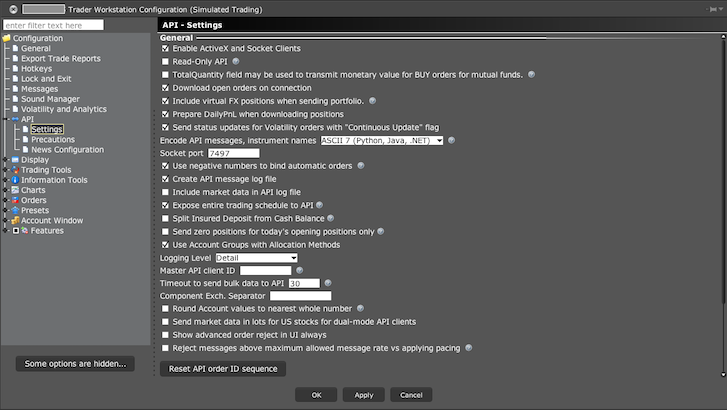

Introduction
============

Currently `backtrader` has a built-in integration for Interactive Brokers (IB) [Trader Workstation API](<http://interactivebrokers.github.io/tws-api/>), but it only works for older versions of the API. 

This project re-worked the orginal integration and created a pluggable version allowing `backtrader` to use the latest IB API.

To start trading follow the steps below:

1.	Open an account with IB 
2.	Download the [IB Python TWS API](https://github.com/InteractiveBrokers/tws-api-public) 
3.	Download the IB client (TWS or IB Gateway) [Trader Workstation Platform](https://www.interactivebrokers.com/en/home.php)
4.	Test for connectivity – Check code sample below

Installation
------------

Create a local python virtual environment:

`python3 -m venv ./env`

Activate the environment, all the following packages will be install in the local ./env directory

`source ./env/bin/activate`

Install backtrader locally (see [Installing Backtrader](https://www.backtrader.com/docu/installation/) for more options)

`pip install backtrader`

Download Interactive Brokers TWS API (from [Trader Workstation API](https://github.com/InteractiveBrokers/tws-api-public))

Select the latest copy, currently it is (twsapi_macunix.1016.01.zip) for Linux

`unzip twsapi_macunix.1016.01.zip`

The file will unzip to the directoty `IBJts`

`cd IBJts/source/pythonclient`

Run the setup.py to install the TWS API.

`python setup.py install`

Download a Atreyu Backtrader API, released version:

`wget https://github.com/atreyuxtrading/atreyu-backtrader-api/archive/refs/tags/v1.0.zip`

Unzip file, and install the Atreyu Backtrader API.

`unzip v1.0.zip`

`cd atreyu-backtrader-api-1.0 ; python setup.py install`

Check Settings of Locally Running TWS
-------------------------------------



Example: Download Realtime Bar Data from TWS
-------------------------------------------

```python
import backtrader as bt
from atreyu_backtrader_api import IBData

cerebro = bt.Cerebro()

data = IBData(host='127.0.0.1', port=7497, clientId=35,
               name="GOOG",     # Data name
               dataname='GOOG', # Symbol name
               secType='STK',   # SecurityType is STOCK 
               exchange='SMART',# Trading exchange IB's SMART exchange 
               currency='USD',  # Currency of SecurityType
               what='BID_ASK',  # Get data fields (see note below)
               rtbar=True,      # Request Realtime bars
               _debug=True      # Set to True to print out debug messagess from IB TWS API
              )

cerebro.adddata(data)
cerebro.run()
```

Create A TestPrinter
--------------------
Note that this is created as a stratgey and will print all the bars that it receives

```python

import backtrader as bt

class TestPrinter(bt.Strategy):

    def log(self, txt, dt=None):
        ''' Logging function for this strategy'''
        dt = dt or self.datas[0].datetime.datetime(0)
        print(f'{dt}, {txt}')

    def __init__(self):
        self.open = self.datas[0].open
        self.high = self.datas[0].high
        self.low = self.datas[0].low
        self.close = self.datas[0].close
        self.volume = self.datas[0].volume
        self.openinterest = self.datas[0].openinterest

    def next(self):
        self.log(f'Open:{self.open[0]:.2f}, \
                   High:{self.high[0]:.2f}, \
                   Low:{self.low[0]:.2f}, \
                   Close:{self.close[0]:.2f}, \
                   Volume:{self.volume[0]:.2f}, \
                   OpenInterest:{self.volume[0]:.2f}' )
        
```

Simple BID_ASK Historical Data
-------------------------------

```python

import backtrader as bt

from atreyu_backtrader_api import IBData
from test_printer import TestPrinter

import datetime as dt

cerebro = bt.Cerebro()

data = IBData(host='127.0.0.1', port=7497, clientId=35,
               name="GOOG",     # Data name
               dataname='GOOG', # Symbol name
               secType='STK',   # SecurityType is STOCK 
               exchange='SMART',# Trading exchange IB's SMART exchange 
               currency='USD',  # Currency of SecurityType
               historical=True,
               what='BID_ASK',  # Update this parameter to select data type
              )

cerebro.adddata(data)

# Add the printer as a strategy
cerebro.addstrategy(TestPrinter)

cerebro.run()

```
Output
------
```
2021-08-09 23:59:59.999986, Open:137.24, High:144.44, Low:136.25, Close:137.55, Volume:-1.00
2021-08-10 23:59:59.999986, Open:138.02, High:139.84, Low:125.00, Close:138.26, Volume:-1.00
2021-08-11 23:59:59.999986, Open:137.54, High:138.95, Low:130.66, Close:137.89, Volume:-1.00
2021-08-12 23:59:59.999986, Open:137.82, High:139.07, Low:130.00, Close:138.12, Volume:-1.00
2021-08-13 23:59:59.999986, Open:138.23, High:139.09, Low:137.78, Close:138.52, Volume:-1.00
2021-08-16 23:59:59.999986, Open:138.04, High:139.90, Low:125.00, Close:138.34, Volume:-1.00
....
2022-08-05 23:59:59.999986, Open:118.06, High:128.00, Low:111.06, Close:118.19, Volume:-1.00
2022-08-07 20:00:00, Open:118.93, High:120.88, Low:113.00, Close:119.02, Volume:-1.00
```

Select Historical Data Types Using "what=" Parameter
-----------------------------------------------------
Historical data is returned in the form of candlesticks, and accessed using the “what=” parameter when requesting data. (see [Interactive Brokers Data Types](https://interactivebrokers.github.io/tws-api/historical_bars.html))


Disclaimer
----------
The software is provided on the conditions of the simplified BSD license.

This project is not affiliated with Interactive Brokers Group, Inc.

